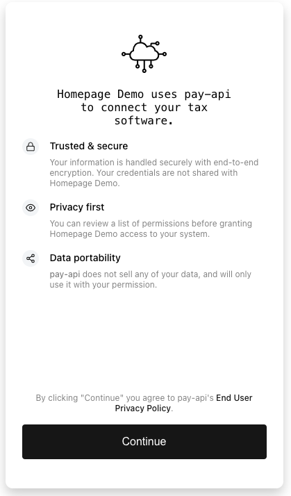
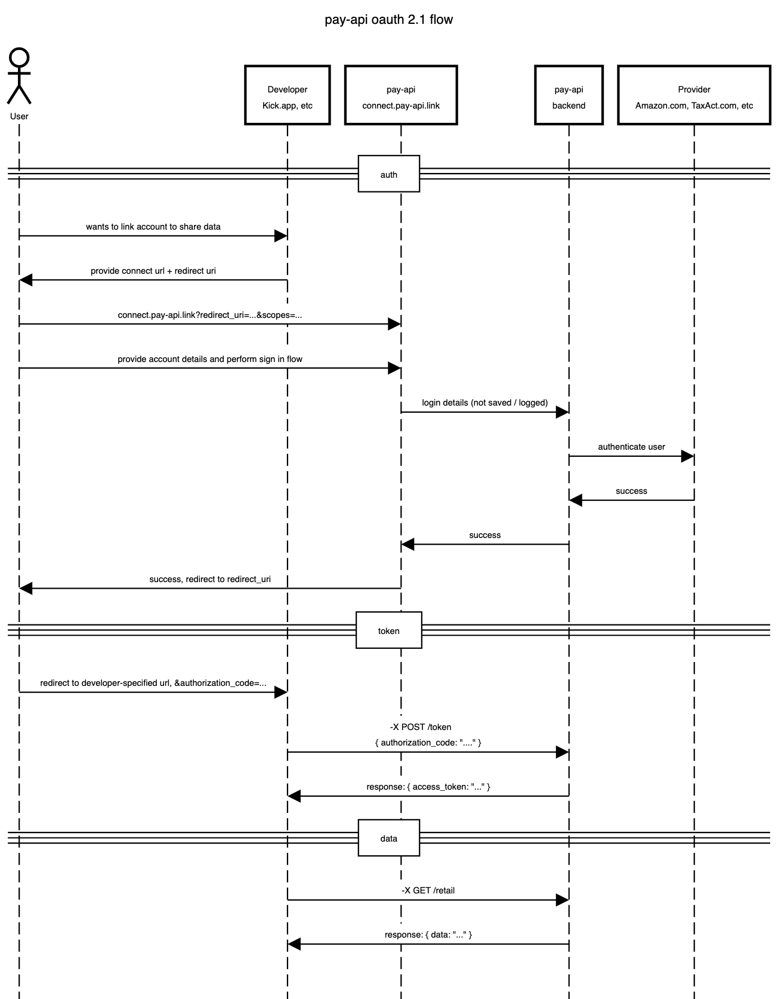

# Connect

<p align="center">
  <a href="https://pay-api.link">
    
  </a>
</p>

## Overview

pay-api is an oauth 2.1 application that allows developers to access customer
data, without developers needing to manage integrations or collect login
credentials from users for these third party systems.

Connect provides a secure and convenient authorization flow for your users to
grant your application access to their provider accounts.

## Integrate

There are two ways to integration Connect into your application's UI.

- your application can generate a connect uri and then redirect your user's
  browser to connect, hosted by pay-api at `https://connect.pay-api.link`.
- your application can open Connect in an `iframe` using the react SDK. Your
  user remains on your domain during the entire authorization flow.

## Demo

[](https://www.loom.com/embed/c43b9ec4e8b94c6cb16c40cb2356066f)

## Parameters to Connect

use these query params (`?param=_value`) to modify behavior of connect to
trigger your desired use case

```
 // your application's client id
- client_id // required

// the type of providers you are after, ie tax, retail
- mode // required

// where to redirect the user after a successful authorization.
// the redirect url will include both `?authorization_code=...&state=...`
// if state was provided; if state was omitted, then there
// will be no state query param in the callback
- redirect_uri // required

// the scopes you are requesting from the user's account, ie identity, tax
- scopes // required

// skip the `Select` page if you already know the user's provider. not required
- provider // optional

// provides a simulated authorization and data flow. uses fake data.
- sandbox // optional

// open-ended field that your application will as a query parameter
// during the callback after a successful authorization.
// example: your user's internal id
- state // optional

// if using the react sdk, you will set this. otherwise, omit it
- app_type // omit
```

## Appendix

### pay-api oauth sequence diagram

<p align="center">
  <a href="https://pay-api.link">
    
  </a>
</p>

### Glossary

- **connect** the pay-api front end, whose url a developer will generate and send to the user
- **developer** (_ex_ _mint.com_) an application that needs programmatic access to a user's account information
- **user** (_ex_ _john smith_) someone who has an account with a provider's system
- **provider** (_ex_ _amazon_) system that does not easily provide a programmatic interface for the developer to use to access data from the user's account
